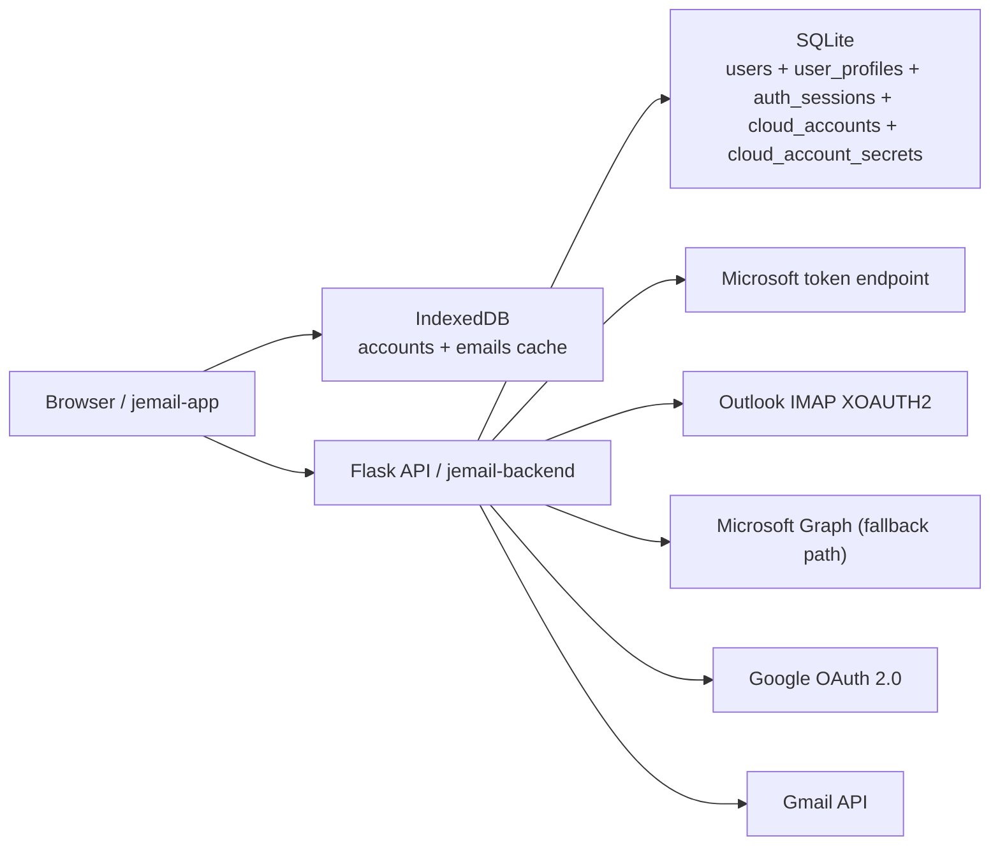

# 架构说明

## 目标

`jemail` 不是传统邮件服务器，也不是完整企业协作套件。

它的定位是：

- 批量导入 Outlook / Microsoft 365 / Gmail 账号
- 在 Web 界面里统一管理这些账号
- 用 refresh token 动态拉取 Microsoft / Google 邮件
- 尽量减少服务端长期存储

## 总体结构

## 前端

前端目录：

- `jemail-app/`：旧版 Vue 本地优先前端
- `_figma_source/`：当前新版 React 前端

特点：

- 本地模式仍以浏览器 `IndexedDB` 为主
- 登录后可把普通资料同步到后端 SQLite
- 完整凭据走单独加密表，登录后可直接拉取和导出
- 账号、分组、邮件缓存主要存浏览器本地

### 本地数据模型

`jemail-app/db.js` 里有两个核心 object store：

- `accounts`
- `emails`

`accounts` 以 `邮箱地址` 作为主键，常见字段包括：

- `邮箱地址`
- `密码`
- `provider`
- `ClientID`
- `刷新令牌`
- `令牌类型`
- `权限已检测`
- `分组`
- `导入序号`

这意味着：

- 同一个浏览器实例就是一个独立数据空间
- 换浏览器或清空站点数据后，本地账号列表也会消失
- 普通云同步只会补回普通资料；完整凭据需要在设置页主动拉取

## 后端

后端目录：`jemail-backend/`

技术栈：

- Flask
- Gunicorn
- SQLite
- requests
- Python 标准库 `imaplib`

### 核心职责

后端现在负责四件事：

1. 托管前端静态文件
2. 提供用户注册 / 登录 / 会话鉴权
3. 同步普通资料到 SQLite
4. 接收前端请求并换微软或 Google 令牌，然后拉取邮件
5. 以加密方式保存完整账号凭据，并在登录后返回给当前用户

### 第一阶段数据库

SQLite 当前包含这些核心表：

- `users`
- `user_profiles`
- `auth_sessions`
- `cloud_accounts`
- `cloud_account_secrets`

设计边界：

- `users` 保存邮箱和密码哈希
- `auth_sessions` 保存哈希后的登录 token，而不是明文会话 token
- `cloud_accounts` 只保存普通展示资料
- `cloud_account_secrets` 保存加密后的完整凭据 JSON
- 邮箱密码、refresh token、2FA 不会进入普通资料表或普通列表接口

### 第一阶段云同步边界

会同步：

- 邮箱地址
- provider
- 分组
- 状态
- 备注
- `oauth_status`
- `oauth_email`
- `oauth_updated_at`
- 导入序号

不会进入普通同步接口：

- 邮箱密码
- Outlook / Gmail refresh token
- `client_id`
- 2FA / 辅助邮箱
- 邮件正文和缓存邮件

如果需要跨设备管理完整资料，必须走单独的完整凭据接口：

- 需要 Bearer 登录态
- 服务端用 `JEMAIL_SENSITIVE_KEY_PATH` 对应的 Fernet key 解密或加密
- 返回到前端后会写入当前浏览器 IndexedDB，方便继续本地管理和导出

### 核心接口

#### `POST /detect-permission`

职责：

- 根据 `client_id + refresh_token` 换 token
- 判断当前账号更适合走 `graph` 还是 `imap`

这条接口仍然只服务于 Microsoft / Outlook 账号。

#### `POST /api/emails/refresh`

职责：

- 根据账号、provider、文件夹和 `token_type` 拉取邮件
- Microsoft 在 `graph` 和 `imap` 之间按策略回退
- Google 直接走 Gmail API

统一返回字段：

- `id`
- `subject`
- `from_address`
- `from_name`
- `received_time`
- `body_preview`
- `body`
- `is_read`

#### `GET /api/oauth/google/start`

职责：

- 发起 Google OAuth 2.0 授权
- 把目标邮箱和返回 origin 签名进 state

#### `GET /api/oauth/google/callback`

职责：

- 用授权码换取 Google token
- 读取 Gmail profile 校验授权邮箱
- 通过 popup `postMessage` 把绑定结果传回前端

#### `POST /api/auth/register`

职责：

- 邮箱 + 密码注册
- 密码以哈希形式入库
- 创建登录会话

#### `POST /api/auth/login`

职责：

- 校验邮箱 + 密码
- 返回 Bearer token 登录态

#### `GET /api/auth/me`

职责：

- 校验当前登录态
- 返回当前用户、同步配置和云端记录摘要

#### `GET /api/cloud/accounts`

职责：

- 返回当前用户的云端普通资料列表

#### `POST /api/cloud/accounts/sync`

职责：

- 接收本地普通资料快照
- 拒绝敏感字段
- 按用户隔离写入 `cloud_accounts`

#### `POST /api/cloud/secrets/sync`

职责：

- 校验 Bearer 登录态
- 接收密码、辅助邮箱、2FA、client_id、refresh token 等完整凭据
- 加密写入 `cloud_account_secrets`
- 不通过普通资料接口暴露这些字段

#### `POST /api/cloud/secrets/unlock`

职责：

- 校验 Bearer 登录态
- 解密返回当前用户自己的完整凭据
- 支持按邮箱过滤
- 前端可用于“拉取完整凭据到本机”和“导出完整账号资料”

## 为什么当前主链是 IMAP

虽然代码同时保留了 Graph 路径，但现阶段这套账号更稳定的成功路径是：

- refresh token -> access token
- IMAP XOAUTH2 登录 Outlook
- 拉取指定文件夹邮件

因此：

- `Graph` 不是当前唯一真相
- 任何后续重构都不能把 `IMAP` 当成边缘功能

## 为什么 Gmail 走 Gmail API

Gmail 新增支持明确采用：

- Google OAuth 2.0 Web Server Flow
- Gmail API `users.messages.list` + `users.messages.get`

不采用：

- Gmail IMAP XOAUTH2
- 非官方网页登录或模拟登录

## 运行方式

这套源码支持：

- 本地直接运行
- 自行部署到任意服务器环境

前端运行时会优先使用：

- `window.JEMAIL_CONFIG.API_BASE`
- 否则回退到当前页面 origin

## 遗留代码说明

仓库里还有两块历史内容：

- `outlook-manager/`：更早期原型
- 根目录 `docker-compose.yml` 和 `.env.example`：Nextcloud 尝试

它们不是当前生产架构的一部分，但暂时保留作历史参考。
